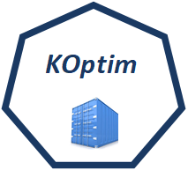

 
 <!--- <h1 align="center">Koptim</h1>  -->


<p align="center">
  
</p>


## Table of Contents

* [Getting Started](#Getting_Started) 
* [Install Kubernetes cluster](#Install_Kubernetes_cluster)
    *   [Install Kubernetes](#Install_Kubernetes)
    *   [Install k3s](#Install_k3s)
    *   [Install MicroK8s](#Install_MicroK8s)
* [Install Koptim](#Install_Koptim)
* [Control of a Koptim installation](#Control_of_a_Koptim_installation)
* [Deleting Koptim](#Deleting_Koptim) 
* [Example of using Koptim](#Example_of_using_Koptim)


## Getting Started <a class="anchor" id="Getting_Started"></a>
Koptim (Kubernetes optimization) is a new framework which can be deployed on top of a kubernetes cluster in a cloud, fog and edge environments (cloud-edge continuum).

that can be Kubernetes multicriteria scheduler.
Before deploying Koptim, you must have a Kubernetes cluster (v1.18 or higher) running with kubectl and Helm installed. 

## Install Kubernetes cluster <a class="anchor" id="Install_Kubernetes_cluster"></a>

koptim can be deployed on kubernetes, k3s and microk8s using the following instructions:

### Install Kubernetes <a class="anchor" id="Install_Kubernetes"></a>
1. Reference [Kubernetes documentation](https://kubernetes.io/docs/tasks/tools/) for instructions on how to install Kubernetes.
2. Check Kubernetes status
```sh
kubectl get node
```
3. Install Helm
```sh
sudo apt install -y curl
curl -L https://raw.githubusercontent.com/helm/helm/master/scripts/get-helm-3 | bash
```
### Install k3s <a class="anchor" id="Install_k3s"></a>

1. Reference [k3s](https://k3s.io/) for instructions on how to install the last k3s version.
```sh
curl -sfL https://get.k3s.io | sh -
```
2. Grant admin privilege to access kube config.
```sh
sudo addgroup k3s-admin
sudo adduser $USER k3s-admin
sudo usermod -a -G k3s-admin $USER
sudo chgrp k3s-admin /etc/rancher/k3s/k3s.yaml
sudo chmod g+r /etc/rancher/k3s/k3s.yaml
su - $USER
```
3. Check K3s status.
```sh
kubectl get node
```
4. Install Helm
```sh
export KUBECONFIG=/etc/rancher/k3s/k3s.yaml
sudo apt install -y curl
curl -L https://raw.githubusercontent.com/helm/helm/master/scripts/get-helm-3 | bash
```
5. If desired, reference [k3s documentation](https://rancher.com/docs/k3s/latest/en/quick-start/#install-script) to add additional nodes to the cluster.

### Install MicroK8s <a class="anchor" id="Install_MicroK8s"></a>

1. Reference [MicroK8s](https://microk8s.io/docs/getting-started) for instructions on how to install the last MicroK8s version.
```sh
sudo apt-get install snapd
snap install microk8s --classic
```
2. Grant admin privilege to access kube config.
```sh
sudo usermod -a -G microk8s $USER
sudo chown -f -R $USER ~/.kube
su - $USER
```
3. Check MicroK8s status.
```sh
microk8s kubectl get node
```
4. Enable CoreDNS, Helm and RBAC for MicroK8s.
```sh
microk8s enable dns helm3 rbac
```
5. If you don't have an existing kubectl and helm installations, add aliases. If you do not want to set an alias, add microk8s in front of all kubectl and helm commands.
```sh
alias kubectl='microk8s kubectl'
alias helm='microk8s helm3'
```
6. If desired, reference [MicroK8s documentation](https://microk8s.io/docs/clustering) to add additional nodes to the cluster.

## Install Koptim <a class="anchor" id="Install_Koptim"></a>

<p align="center">
  
</p>


Koptim is most easily deployed with Helm charts. Helm charts provide convenient packaging and configuration. You can deploy these versions of Koptim with the following commands:
```sh
helm repo add koptim-helm-charts http://tmenouer.github.io/koptim-scheduler/
helm install koptim koptim-helm-charts/koptim
```
## Control of a Koptim installation <a class="anchor" id="Control_of_a_Koptim_installation"></a>

Run the following command:
```sh
kubectl get deployment -n kube-system 
```
You should see the koptim-koptim-scheduler deployment en mode running 

```sh
NAME                      READY   UP-TO-DATE   AVAILABLE   AGE
local-path-provisioner    1/1     1            1           16m
coredns                   1/1     1            1           16m
metrics-server            1/1     1            1           16m
traefik                   1/1     1            1           15m
koptim-koptim-scheduler   1/1     1            1           7m51s
```
Run also the following command:
```sh
kubectl get daemonset 
```
You should see the koptim-koptim-criteria daemonset en mode running 

```sh
NAME                     DESIRED   CURRENT   READY   UP-TO-DATE   AVAILABLE   NODE SELECTOR   AGE
koptim-koptim-criteria   1         1         1       1            1           <none>          5m48s
```


## Deleting Koptim <a class="anchor" id="Deleting_Koptim"></a>
run the folowwing command:
```sh
helm uninstall koptim
```
## Example of using Koptim <a class="anchor" id="Example_of_using_Koptim"></a>
To use the Koptim scheduler, you have to reference the schedulerName in each Kubernetes object. The name of the Koptim scheduler is composed of two parts: the name of the helm + koptim-scheduler. If the name of the helm is Koptim, the scheduler name is **koptim-koptim-scheduler**.
For example, to schedule a Pod (koptim-pod) or a Deplyment (koptim-deployment) using koptim, you shold add the scheduler name as following:

### koptim-pod

```sh
apiVersion: v1
kind: Pod
metadata:
  name: koptim-pod
spec:
  schedulerName: koptim-koptim-scheduler
  containers:
  - name: container
    image: nginx

```
```sh
koptim@node0:~$ kubectl create -f pod-koptim.yaml 
pod/koptim-pod created
koptim@node0:~$ kubectl get pod
NAME                           READY   STATUS    RESTARTS   AGE
koptim-koptim-criteria-r4z8g   1/1     Running   0          43m
koptim-pod                     1/1     Running   0          23s
```
The koptim-pod is scheduled using koptim-koptim-scheduler
```sh
kubectl describe pod koptim-pod
```
In the description of the pod you will find the name of scheduler:

```sh
 Type    Reason     Age   From                     Message
  ----    ------     ----  ----                     -------
  Normal  Scheduled  60s   koptim-koptim-scheduler  Successfully assigned default/koptim-pod to node1
  ```

### koptim-deployment

```sh
apiVersion: apps/v1
kind: Deployment
metadata:
  name: koptim-deployment
spec:
  replicas: 1
  selector:
    matchLabels:
      app: nginx
  template:
    metadata:
      labels:
        app: nginx
    spec:
      schedulerName: koptim-koptim-scheduler
      containers:
      - name: nginx
        image: nginx
```
```sh
koptim@node0:~$ kubectl create -f koptim-deployment.yaml 
deployment.apps/koptim-deployment created
koptim@node0:~$ kubectl get deployment
NAME                READY   UP-TO-DATE   AVAILABLE   AGE
koptim-deployment   1/1     1            1           24s
```

The koptim-deployment is scheduled using koptim-koptim-scheduler
```sh
kubectl get pod
```
```sh
koptim@node0:~$ sudo kubectl get pod
NAME                                 READY   STATUS    RESTARTS   AGE
koptim-deployment-5d555f47f8-fc722   1/1     Running   0          2m21s
koptim-koptim-criteria-r4z8g         1/1     Running   0          47m
koptim-pod                           1/1     Running   0          3m55s

```
```sh
kubectl describe pod koptim-deployment-5d555f47f8-fc722
```
In the description of the pod you will find the name of scheduler:

```sh
 Type    Reason     Age    From                     Message
  ----    ------     ----   ----                     -------
  Normal  Scheduled  3m58s  koptim-koptim-scheduler  Successfully assigned default/koptim-deployment-5d555f47f8-fc722 to node1
```
<p align="center">
  
</p>
